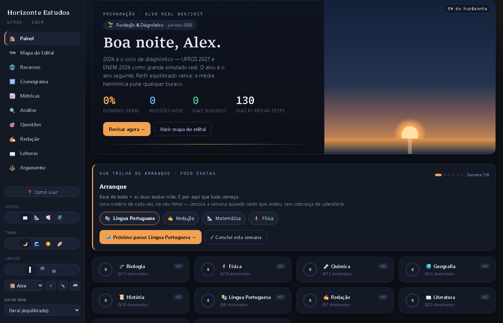

# Horizonte — Painel de Estudos (ENEM / UFRGS)

PWA de estudos **offline-first, sem frameworks** (vanilla JS puro), com sincronização
multi-dispositivo via Cloudflare (Pages + Functions + D1 + Worker de push).
Feito para preparação ENEM/vestibular UFRGS, mas a arquitetura serve para qualquer
painel pessoal de estudo.



> Todos os nomes e dados pessoais foram substituídos por personagens fictícios
> (**Alex**, o titular; **Bia**, a convidada). Os dados de provas são públicos (ENEM/UFRGS).

## O que tem dentro

| Módulo | O que faz |
|---|---|
| `painel/` | O app em si: HTML + JS vanilla, PWA instalável, funciona 100% offline |
| `painel/*-data.js` | Dados gerados: banco de questões oficiais classificadas por tópico, frequência por assunto, edital interativo, leituras obrigatórias, redações nota mil, rubricas de correção |
| `functions/` | API (Cloudflare Pages Functions) para sync de estado entre dispositivos |
| `worker-push/` | Worker de notificações push (Web Push + VAPID) |
| `pipeline/` | Scripts que baixam/classificam provas e geram os `*-data.js` |
| `pipeline/verificar/` | Probes headless (CDP) que validam o painel: offline, largura, visual |
| `infra/schema.sql` | Schema do banco D1 (perfis, estado, sync) |
| `docs/estudo/` | **Material didático completo**: cada arquivo do código explicado linha a linha |

## Destaques de arquitetura

- **Zero dependências no front.** Sem build, sem bundler: `<script src>` e pronto.
- **Offline-first de verdade.** Service worker com cache versionado; o painel abre
  em modo avião, e o sync reconcilia depois (last-write-wins por chave).
- **Dois perfis, um deploy.** O mesmo código serve o painel completo (com cofre
  Obsidian local) e o "painel-presente" (`--kit`), uma versão-presente publicada
  para outra pessoa, sem cofre — a detecção é em runtime (`semCofre()`).
- **Dados como código.** O pipeline transforma PDFs/provas em `*-data.js` commitados:
  o front nunca depende de API para conteúdo, só para sync.

## Como rodar

```bash
# 1. Local: qualquer servidor estático resolve
npx serve painel

# 2. Deploy (Cloudflare Pages + D1)
#    - crie um banco D1 e cole o id em wrangler.toml (SEU-DATABASE-ID-AQUI)
#    - aplique infra/schema.sql
npx wrangler pages deploy painel

# 3. Push (opcional) — ver docs/ATIVAR-PUSH.md (gera par VAPID e sobe o worker)
```

## Trilha de estudo (docs/estudo)

Se você quer **aprender** com este projeto, comece por:

1. `docs/estudo/ROTEIRO.md` — ordem de leitura sugerida
2. `docs/estudo/ARQUITETURA.md` — visão geral e diagramas
3. `docs/estudo/*.explicado.md` — cada arquivo-fonte comentado em profundidade
4. `docs/estudo/EXERCICIOS.md` + `LABORATORIO.md` — para praticar em cima do código

## Estado

Versão pública e anonimizada de um painel que está em uso real. O código roda como está;
o deploy é **manual** (`wrangler pages deploy`) — push neste repositório não publica nada.

**Tecnologias:** HTML + CSS + JavaScript puro, Service Worker, `localStorage`, Cloudflare
Pages Functions + D1 (SQLite) + Worker com cron para push; pipeline em Node e Python.

**Como verificar:** as sondas de `pipeline/verificar/` dirigem um Chromium real por CDP
(ver o `README.md` de lá). Exemplo, a partir da raiz:

```bash
python -m http.server 8899 &              # as sondas esperam a porta 8899
node pipeline/verificar/audit-mobile.js   # celular 390px: vazamento, alvo pequeno, campo < 16px
```

## Pendências

- O painel original tem uma versão-presente com fotos e bilhetes pessoais; esse material
  **não** entra aqui (é privado) — no modo `--kit` as telas que dependem dele ficam vazias.
- `test-qr.js` precisa de um venv com `opencv-python-headless` e assume caminho Linux (`.venv/bin/python`).
- Revisão de 08/10/2026: campos de formulário no celular estavam com fonte 12,5–14px, o que
  faz o iPhone dar zoom ao focar. Corrigido no `@media(hover:none)` de `painel/index.html`
  e vigiado pelo `audit-mobile.js` (achado `campo-zoom-ios`). Removido o `test-rubricas.js`,
  que testava a correção de redação por IA (recurso que saiu do projeto).

## Para estudar

1. **Repetição espaçada SM-2** — `painel/app-plano.js`, `reviewCard` (início do arquivo).
   Explicado em `docs/estudo/app-plano.explicado.md`.
2. **Média harmônica ponderada** — `painel/app-painel.js`, `computeSim`: uma prova fraca
   derruba o escore mais do que na média comum.
3. **Merge de estado entre aparelhos** — `painel/sync.js`, `mergeSecao`: regra de conflito por
   seção. Explicado em `docs/estudo/sync.explicado.md`.
4. **Service Worker "rede primeiro"** — `painel/sw.js`, ouvinte `fetch`: navegação tenta a rede
   e cai no cache offline; `/api/` nunca é cacheado. Ver `docs/estudo/sw.explicado.md`.

## Licença

MIT — direitos autorais reservados ao autor, uso, cópia e modificação liberados
(ver `LICENSE`).
