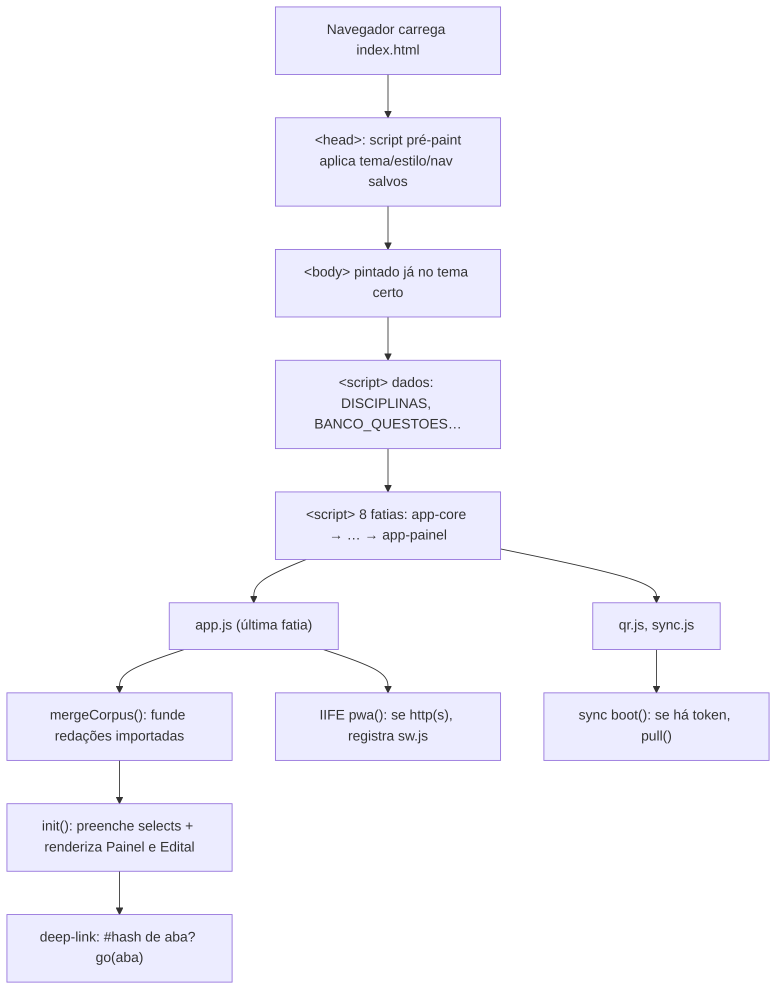
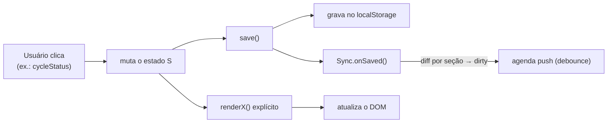
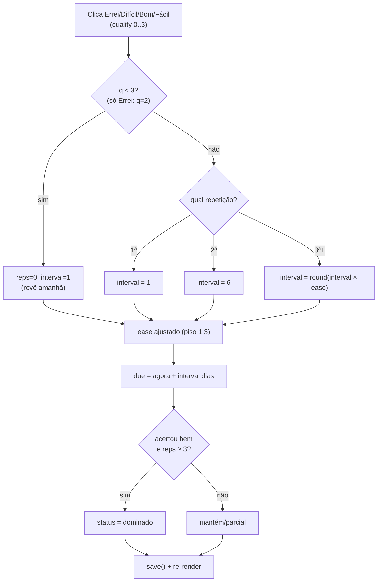
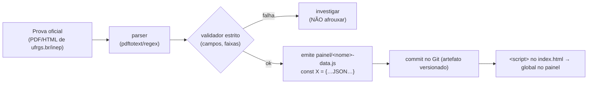
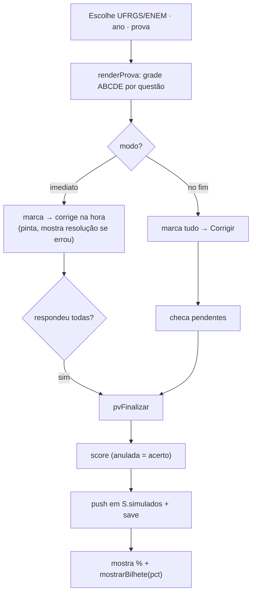
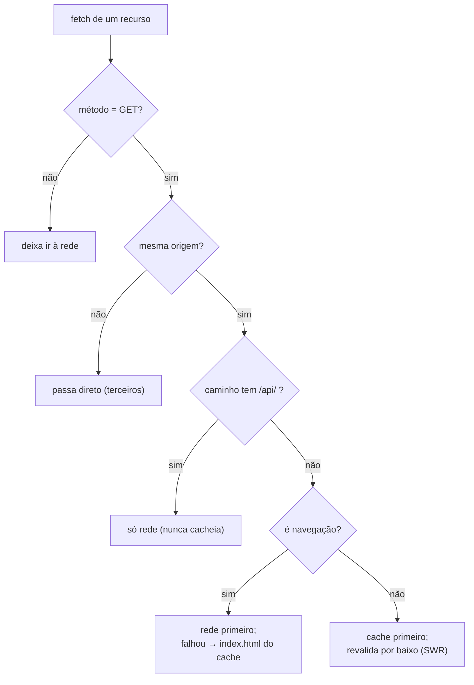
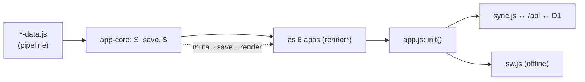

# 🔀 FLUXOGRAMA — os principais fluxos do painel

> Os caminhos de execução mais importantes, em **diagrama** (Mermaid, que o GitHub renderiza) +
> texto. Se um `.explicado.md` conta o "o quê" de cada função, aqui você vê **como elas se
> encadeiam** no tempo. Comece pelo **boot**.

---

## 1. O boot — do `<script>` à primeira tela



**A leitura:** o tema é aplicado **antes** do paint (sem flash); os dados carregam antes do
código; o código carrega em ordem (core primeiro); `app.js` por último **executa** o boot; o
PWA e o sync entram depois. → [app.js](app.explicado.md), [index-html](index-html.explicado.md) C.4.

---

## 2. O ciclo de render — o "batimento cardíaco" do app



**A leitura:** não há reatividade mágica. Toda interação segue **muta `S` → `save()` →
re-renderiza**. O `save()` persiste **e** avisa o sync (que decide o que subir). Esquecer o
re-render = tela desatualizada. → [app-edital](app-edital.explicado.md) §4, [app-core](app-core.explicado.md).

---

## 3. Sincronização entre aparelhos — pull e push

```mermaid
sequenceDiagram
  participant PC as Painel (PC)
  participant API as /api/state (Cloudflare)
  participant DB as D1 (SQLite)
  Note over PC: boot com token
  PC->>API: GET /state (Bearer token)
  API->>DB: SELECT states WHERE profile
  DB-->>API: seções + updated_at
  API-->>PC: { profile, sections }
  Note over PC: applyRemote: troca seção só se ts remoto > local
  PC->>API: PUT /state (as seções locais)
  API->>DB: UPSERT só onde ts entrada > guardado (LWW)
  API-->>PC: estado mesclado
  Note over PC: converge; o ts local lembra o que falta subir
```

**A leitura:** a **mesma regra dos dois lados** (o mais novo vence, por seção) faz o estado
**convergir** sem fila persistente. `pull` termina chamando `push`; `push` termina reincorporando
o merge do servidor. → [sync](sync.explicado.md) §5, [functions-state](functions-state.explicado.md) §6.

---

## 4. SM-2 — revisar um card de repetição espaçada



**A leitura:** o intervalo cresce geometricamente ao acertar (`× ease`) e **reseta só ao
errar** — "Difícil" (q=3) **não** reseta: progride o intervalo e paga derrubando o `ease`
(−0,14), o "controlador" da velocidade. Acertar com folga várias vezes promove a domínio. →
[app-plano](app-plano.explicado.md) §1.

---

## 5. Como um `*-data.js` nasce — o pipeline



**A leitura:** um "build step" manual: fonte não-confiável → parser → **barreira** de validação →
artefato `.js` versionado. O painel carrega o artefato pronto (não roda o pipeline). →
[pipeline](pipeline.explicado.md) §1, [dados](dados.explicado.md).

---

## 6. Corrigir uma prova oficial pelo gabarito



**A leitura:** a grade só tem a letra do gabarito; o cruzamento com o banco (enunciado/tópico) só
aparece **se o gabarito bater** (guarda de integridade). Questão anulada conta como acerto. →
[app-banco](app-banco.explicado.md) §6.

---

## 7. Service worker — a decisão a cada requisição



**A leitura:** cada tipo de recurso tem a estratégia certa. É o que faz a 2ª abertura ser
instantânea e o app abrir offline. → [sw](sw.explicado.md) §3–§4.

---

## 8. O wizard de redação — máquina de estados

```mermaid
stateDiagram-v2
  [*] --> Passo1
  Passo1: Passo 1 — escolher a rubrica (banca)
  Passo2: Passo 2 — escolher o tema (proposta)
  Passo3: Passo 3 — escrever & registrar nota
  Passo1 --> Passo2: wizBanca(k)
  Passo2 --> Passo3: wizTema(id) → abre editor
  Passo2 --> Passo1: trocar critério
  Passo3 --> Passo2: trocar tema
  Passo3 --> [*]: fecha editor → autosave do rascunho
  note right of Passo2: guardas: não avança sem<br/>banca (2) e sem tema (3)
```

**A leitura:** o objeto `WIZ` governa o fluxo; as guardas proíbem pular etapas; fechar o editor
**salva o rascunho sozinho** (evento `close` do `<dialog>`). → [app-redacao](app-redacao.explicado.md) §1, §5.

---

## Como os fluxos se conectam



Da esquerda para a direita: os **dados** (nascidos no pipeline) alimentam o **core**, que serve
as **abas**, ligadas no **boot**, estendido por **sync** (nuvem) e **service worker** (offline). O
laço pontilhado é o ciclo de render do §2, que pulsa dentro de tudo.

---

*Próximo: [EXERCICIOS.md](EXERCICIOS.md) — teste o que você aprendeu (com gabarito ao final).*
